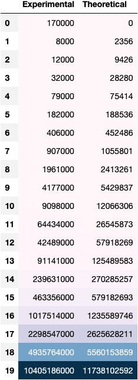
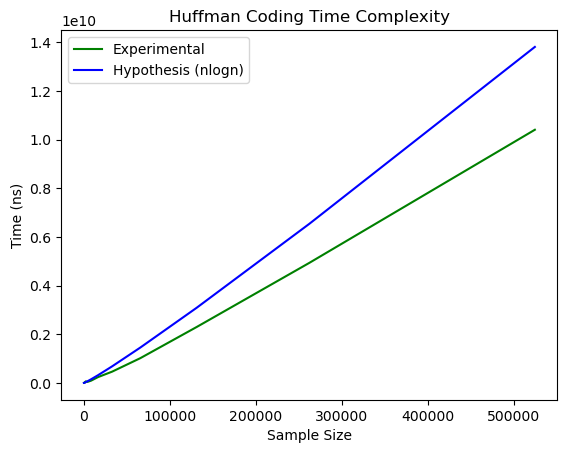

# **Algorithms Project 2 -- Marshall Thompson**

## **1. Implementation Specifics**

### **Inputs**

It is assumed that there are two lists given as input. First, a set of symbols. Second, is the corresponding frequencies of occurence for those symbols. 

### **Implementation**

#### **Approach**
My approach relies on a min heap to achieve optimality. A min heap allows for easy retrieval of the minium element of the set. This is necessary as a greedy approach to constructing Huffman trees relies on pairing the two symbols with minimum probability. Furthermore, when inserting nodes back into the heap the order is maintained, so further removals from the heap remain in the proper order.

The minimum elements are disireable for creating an optimal Huffman Coding as we want the symbols with the greatest probability to appear near the top of the tree and thus have a shorter encoded length. This is true of pairs of symbols as well which are created in the Huffman Encoding Algorithm. Symbols with greater probability will be paired later in the algorithm and thus be higher in the tree.

A heap is optimal in finding the minimum ( O(logn) ) over brute force and unordered binary tree ( O(n) ). 

For my implementation I used the Python ```heapq``` library for a min heap, and I created my own Node class for ease of use and comparison. The Node class can be seen below


<!-- 
My approach is as follows:

1). Create a min heap!

2). Remove the two least probable symbols from the heap

3). Make a new node that is the sum of the two removed nodes' probabilities

4). Add new node to heap

5). Repeat until there is 1 node in Heap

- All other nodes are children of the 1 node in heap -->


#### **PseudoCode**
```
class Node:
    symbol,
    freq,
    left,
    right,
    huffman_code

    # overrides < operator
    def overridePythonLessThan(otherNode)
        return this.freq < otherNode.freq

def huffman(syms, freqs):
    huffman_heap = Heap

    n = len(syms)
    for i=0-->n:
        add (syms[i], freq[i]) to huffman_heap

    while len(huffman_heap) > 1:
        left_node = huffman_heap.pop()
        right_node = huffman_heap.pop()

        left_node.huffman_code = 0
        right_node.huffman_code = 1

        new_freq = left_node.freq + right_node.freq

        new_node = Node(new_freq, left=left_node, right=right_node)
```

## **2. Numerical Results**

Table            |  Graph
:-------------------------:|:-------------------------:
  |  

